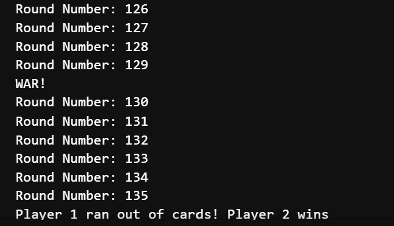

# WAR
This Python project simulates the card game 'War' between two computer players. The game involves shuffling a deck, dealing cards to each player, and playing multiple rounds where cards are compared based on rank. In the event of a tie, a 'war' is declared, and additional cards are drawn. The game continues until one player runs out of cards. This simulation demonstrates fundamental object-oriented principles using classes for Card, Deck, and Player

## Running the game
To run the War card game simulation, follow these steps:

### Prerequisites

- Ensure you have Python 3.x installed on your machine. Download it from [python.org](https://www.python.org/downloads/).
- (Optional) Use a virtual environment for dependency management.

### Setting Up the Project

1. **Clone the Repository**:
   Open your terminal and clone the repository:  

   ```bash
   git clone https://github.com/your-username/war-game.git  

   
   Replace your-username with your GitHub username


2. **Navigate to the Project Directory**: Change into project directory:  
   ```bash
   cd WAR


3. **Start the Game**: To run the simulation, execute the following command:  
   ```bash
   python src/game.py


### Usage



### Notes
- The game simulates a match between two computer players and continues until one player runs out of cards.

- Feel free to modify the game logic in the src/game.py file to add new features or change the rules.


### Upcoming Features
-  Smarter game logic

-  Analysis of number rounds required for the game to end for larger sample size

